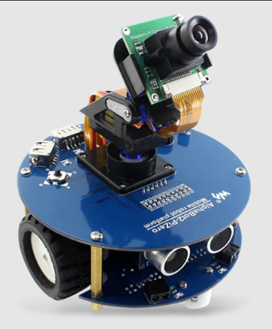
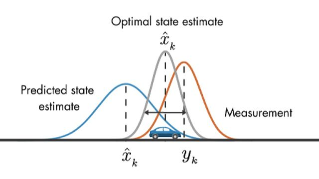
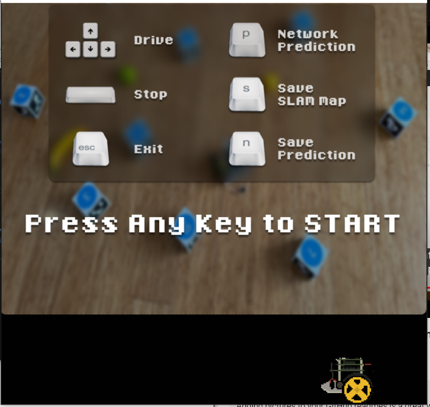
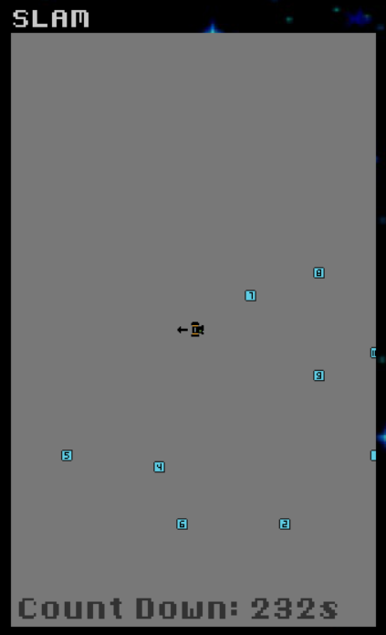
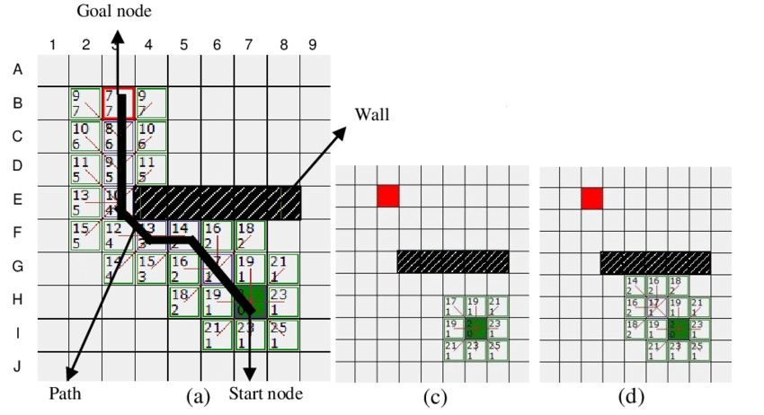
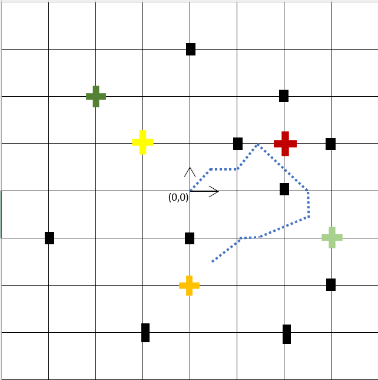

# AlphaBot2-autonomous-car
This is project is to build and code a autonomous car using **AlphaBot2**. The raspberry pi in the AlphaBot2 is the server while the laptop is the client who control the server.



There are two parts in the project which is mapping and autonomous driving.
# Mapping (Part 1)


The locations of the auro markers and the fruits are needed to be mapped. Therefore, __this mapping part uses camera and AlphaBot2's location adjusted by Kalmen filter to estimate the auro markers and the fruits. A trained YOLO5 model is used to detect the fruit and OpenCV function is used to detect the auro markers from the images from the camera.__

The layout of the arena is shown in the image below where there are 4 fruits and 10 auro markers.


Running the command below to start (replace the xxxxx with ip address of the raspberry pi)
```
python operate.py --ip xxxxx
```

the intructions to control the AlphaBot2 is shown when the program start



After running AlphaBot2 in the arena, a map of the auro markers and the fruit are estimated.
- [lab_output/slam.txt](lab_output/slam.txt) (auro marker estimated locations)
- [lab_output/targets.txt](lab_output/targets.txt) (fruits estimated locations)


# Autonomous driving (Part 2)
After the map of the auro markers and fruits are estimated. A __modified A* algorithm__ is used for **path planning** from the location of the AlphaBot2 to the fruits. It assigns 8 nodes around the AlphaBots and calculate the displacement of each nodes to the fruit. Node with the least displacement to the fruit and is not near the auro markers (obstacles) is selected. The steps repeats with the newly selected node until the selected node is locate near the fruit location. All the selected nodes are recorded and will be the path the AlphaBot2 needs to move. AlphaBot2 will move node by node to each each fruits.



**Kalmen filter** will be used to adjust the AlphaBot2 location by viewing the auro markers from the camera and using the known location of the markers and the motor pwm pulses.

Sample of planned path:
The colored plus signs are the fruits and the black boxs are the auro markers (obstacles). __The dotted lines are the planned path by A* algorithm__. AlphaBot2 will move to within 0.4m from the fruits in order to be considered as reached to fruits. It moved from red (red apple) to green (green apple) and lastly to orange (orange fruit).


